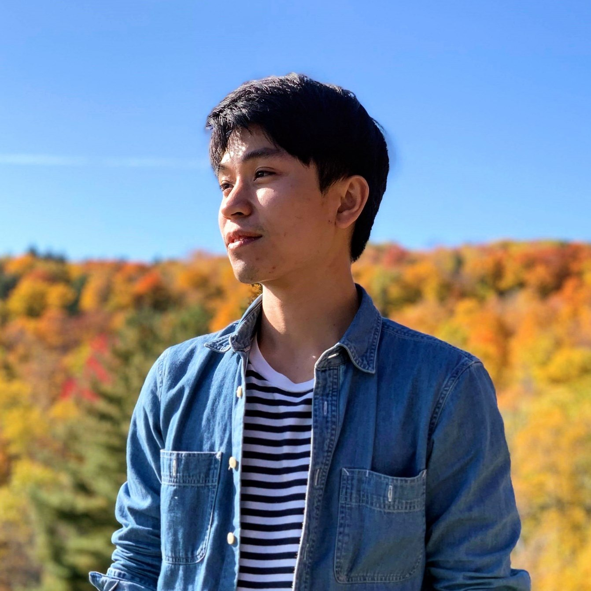
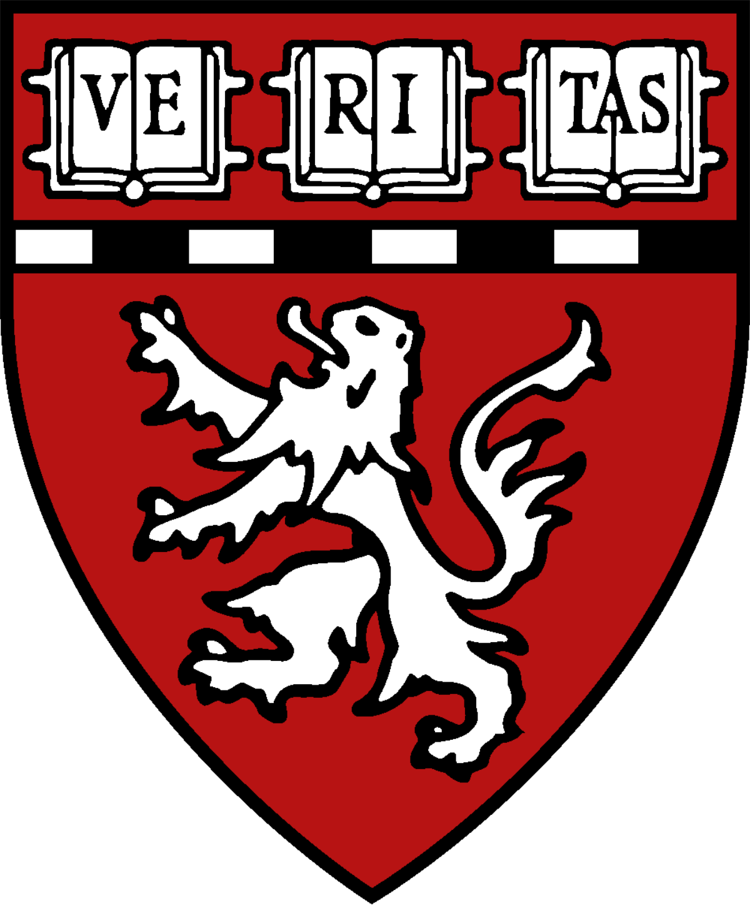
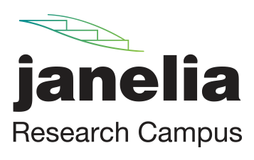

---
# Feel free to add content and custom Front Matter to this file.
# To modify the layout, see https://jekyllrb.com/docs/themes/#overriding-theme-defaults

layout: page
---

Hi there, welcome to my personal website! I am currently a postdoc in the [Lee Lab](https://lee.hms.harvard.edu/) at Harvard Medical School seeking to understand how the brain computes at the circuit level and how to apply these findings to digital computers and machine learning. Previously I was advised by Professor [David Wentzlaff](http://www.princeton.edu/~wentzlaf/) in the [Parallel Computing](http://parallel.princeton.edu) research group and got my PhD from Princeton University in 2018. 

## [Resume (12/2021)](https://www.dropbox.com/s/njznabyrc5q0frg/github_resume.pdf?dl=1)

 
 
 

## Experiences

**Harvard Medical School**  
Boston, MA  
*Postdoc Fellow in Neurobiology*

 

**HHMI Janelia Research Campus**  
Ashburn, VA  
*Visiting Researcher*

 

**Princeton University**  
Princeton, NJ  
*Research Assistant*

 

**NVIDIA Research**  
Redmond, WA  
*Research Intern*

 

**AMD Research**  
Boxborough, MA  
*Research Intern*

 

**Samsung**  
Giheung, South Korea  
*Engineering Intern*

 

